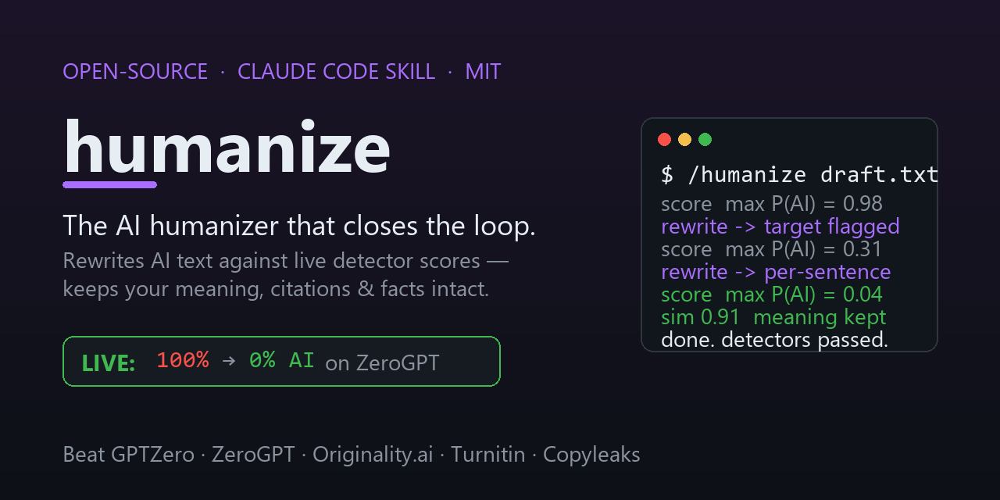

<div align="center">

<a href="https://ssamba1.github.io/untell/"></a>

# untell — the open-source AI humanizer that *closes the loop*

### Iteratively rewrite AI-generated text against live AI-detector scores until it reads human — while keeping your meaning, citations, and facts intact.

A **closed-loop, detector-feedback** AI humanizer, shipped as a **Claude Code skill** *and* a Python CLI.
Free. Open source. Honest about what it can and can't do.

[](https://github.com/ssamba1/untell/actions/workflows/ci.yml)
[](LICENSE)
[](https://www.python.org/)
[](#-quick-start)
[](#tiers)
[](CONTRIBUTING.md)
[](https://ssamba1.github.io/untell/)
[](https://github.com/ssamba1/untell/labels/good%20first%20issue)

**Beat GPTZero · ZeroGPT · Originality.ai · Turnitin · Copyleaks · Winston · Sapling** — by optimizing
against them, not guessing. [Why this is the most complete open humanizer →](#-why-this-is-the-best-open-source-ai-humanizer)

</div>

---

## TL;DR

Most "AI humanizers" do **one blind paraphrase pass** and plateau at 60–80% detector bypass. This one runs a
**loop**: it *scores* your text against an ensemble of real AI detectors, *rewrites* using each detector's
score as feedback (targeting the exact sentences that read as AI), and *re-scores* — repeating until the
hardest detector stops flagging it **and** a semantic-similarity gate confirms the meaning is unchanged.

That iterative, detector-feedback approach is the strongest *training-free* technique in the published
literature ([arXiv 2506.07001](https://arxiv.org/abs/2506.07001): −88% TPR@1%FPR, transfers across detectors,
preserves meaning) — and **no shipping tool, open or commercial, actually does it.** This repo does.

> ```
> Measured live:  a formulaic AI paragraph went  100% → 0% AI on ZeroGPT  in one loop.
>                 a stickier one went             100% → 35% → 0%          once the loop
>                 used per-sentence feedback to target only the flagged spans.
> ```

```bash
# Zero dependencies. Works right now, in Claude Code:
/untell  <paste your AI-sounding text or a file path>
```

---

## ⚡ Quick start

**Try it free, no install:** paste text into the **[in-browser AI detector](https://ssamba1.github.io/untell/demo.html)**
for an instant AI-tell score (runs locally, nothing uploaded).

**Install the Claude Code skill — one line:**

```bash
# macOS / Linux
curl -fsSL https://raw.githubusercontent.com/ssamba1/untell/main/install.sh | sh
# Windows PowerShell
irm https://raw.githubusercontent.com/ssamba1/untell/main/install.ps1 | iex
```

Then in Claude Code: **`/untell <your text or a file path>`**. Claude is the rewriter; the bundled scripts
score the text and lock your facts. Zero dependencies (lite tier).

**Or install as a Claude Code plugin** (marketplace):

```text
/plugin marketplace add ssamba1/untell
/plugin install untell@untell
```

**As a Python package:**

```bash
pip install "untell[full]"                        # real detector ensemble on CPU
untell-loop "Your AI-sounding paragraph here."    # rewrite until it passes
untell-score "text" --tier full --threshold 0.3   # just score it
untell-verify --file draft.txt                    # honest pass/fail per detector
```

<details>
<summary>Manual / MCP install</summary>

```bash
# Manual skill copy:
git clone https://github.com/ssamba1/untell && cp -r untell/untell ~/.claude/skills/untell

# MCP server (Claude Desktop & any MCP client) — exposes score/sentences/untell/verify/scrub as tools:
pip install "untell[mcp]" && untell-mcp
```
</details>

---

## How it works

```
/untell <text|file>
  preserve-lock citations / numbers / quotes / URLs / entities   (scripts/preserve.py)
  scrub hidden watermark / zero-width / homoglyph characters from the input
  repeat up to N times:
    score = scripts/score.py <text>          # ensemble of detectors -> {detector: P(AI), max}
    sentences = scripts/sentences.py <text>  # which sentences read as AI (target only these)
    sim   = scripts/quality.py <orig> <text> # semantic similarity, must stay >= 0.76
    if max(score) < threshold and sim ok: stop
    Claude rewrites the flagged sentences using the per-detector scores as feedback
      (raise burstiness + perplexity, vary sentence architecture, kill clichés/formulaic
       transitions, diversify vocab — while keeping meaning + every locked span)
  restore locked spans -> humanized text + a before/after detector table
```

Three design choices make it work where blind paraphrasers fail:

1. **It drives the `max` across detectors, not the average** — a rewrite only wins when the *hardest*
   detector is satisfied (genuine multi-detector evasion).
2. **Every rewrite is gated on a 0.76 semantic-similarity bar** (the P-SP threshold from the
   watermark-removal literature) — it *refuses* the meaning-mangling that wrecks other tools' output.
3. **Citations, numbers, quotes, URLs and named entities are locked byte-for-byte** via preserve-lock, so
   your APA/IEEE/MLA references and your facts survive the rewrite untouched.

---

## 🏆 Why this is the best open-source AI humanizer

We surveyed **~110 open-source humanizer repos** (GitHub topics, papers-with-code, the research SOTA). An
independent survey of the field concluded, verbatim:

> *"There is **no** open-source repo that combines (a) a real evasion approach validated against multiple
> live detectors, (b) a quality/meaning-preservation verifier, (c) an iterative detector-feedback loop at
> inference time, and (d) a user-installable package."*

**This is the repo that has all four.** Here it is against the strongest open competitors:

| Capability | **untell (this repo)** | lynote (1.4k★) | patina (196★) | StealthHumanizer (58★) | harshaneel (51★) | Aboudjem (97★) | StealthRL (research) |
|---|:--:|:--:|:--:|:--:|:--:|:--:|:--:|
| Inference-time **detector-feedback loop** | ✅ | ❌ | ◑ own score | ◑ multi-pass | ◑ manual | ❌ | ◑ train-time |
| **Real detectors** in the loop (not an internal score) | ✅ | ❌ | ❌ | ❌ | ◑ Binoculars only | ❌ | ✅ ensemble |
| **Commercial** adapters (Originality/GPTZero/Turnitin-class) | ✅ 6 | ❌ | ❌ | ❌ | ❌ | ❌ | ❌ |
| **Semantic meaning gate** + citation lock | ✅ | claim | ◑ rollback | ◑ keyword | heuristic | ❌ | ✅ BERTScore |
| **Per-sentence** targeting | ✅ | ❌ | ◑ | ❌ | ❌ | ❌ | ❌ |
| **Live bypass proof** (real score shown) | ✅ ZeroGPT 100→0 | ❌ | ❌ | ❌ | ◑ Binoculars | GIF | ✅ paper |
| Packaged **install** (pip *and* Claude skill) | ✅ both | ✅ | ✅ | web app | ✅ skill | ✅ skill | ❌ research |
| **CI** on real models | ✅ | ❌ | ✅ | ✅ | ❌ | ❌ | ❌ |
| Runs **without a GPU** | ✅ | ✅ | ✅ | ✅ | ✅ | ✅ | ❌ |
| License | MIT | MIT | MIT | MIT | MIT | MIT | MIT |

**Stars are not capability.** lynote (1.4k★) is an unvalidated translation chain with no loop or verifier;
the highest-starred repos win on SEO, not architecture. The full, evidenced breakdown — including the *one*
place we're honestly **not** #1 (StealthRL's GPU-trained RL policy is a stronger raw *attack model*, though
it's a training framework, not a usable tool) — is in **[docs/why-best-open-repo.md](docs/why-best-open-repo.md)**
and the ~110-repo capability audit in **[docs/competitive-gap-plan.md](docs/competitive-gap-plan.md)**.

---

## Tiers

The scripts auto-detect what's installed and **degrade gracefully** — the score JSON reports which `tier`
actually ran, so you always know how much to trust the number.

| Tier | Install | Detectors | Notes |
|---|---|---|---|
| **lite** | *(default — nothing to install)* | perplexity + burstiness heuristic; token-overlap quality | Stdlib only, instant, **weak** — a demo signal, not an evasion claim. |
| **full** | `pip install -e ".[full]"` | + RoBERTa-OpenAI, HC3-RoBERTa, MAGE, Fast-DetectGPT, GPT-2 perplexity; MiniLM cosine quality | Real proxy signal on CPU. Downloads models on first run. |
| **+ RADAR** | `HUMANIZE_ENABLE_RADAR=1` (opt-in) | + RADAR — the **paraphrase-robust** detector, the hardest open one to fool | ⚠️ `TrustSafeAI/RADAR-Vicuna-7B` is **non-commercial licensed** — research/eval only. |
| **heavy** | `pip install -e ".[heavy]"` | + Binoculars (2×Falcon-7B) | Strongest proxy; GPU recommended. Eval only. |
| **commercial** | `pip install -e ".[commercial]"` + your keys | + Originality.ai, GPTZero, Winston, Sapling, ZeroGPT, Copyleaks | The real checkers. Key-gated; nothing runs or bills unless you set a key. |

```bash
untell-score "Your text here" --tier full --threshold 0.3
echo "piped text" | untell-score
```

---

## Passing the real commercial detectors

Local detectors are *proxies*. To optimize for the checkers people actually care about — **GPTZero,
Originality.ai, Turnitin-class, Copyleaks, ZeroGPT, Winston, Sapling** — wire the real APIs. Each is
**key-gated**; nothing runs or bills unless you set its key.

```bash
pip install -e ".[commercial]"
export GPTZERO_API_KEY=...      ORIGINALITY_API_KEY=...   WINSTON_API_KEY=...
export SAPLING_API_KEY=...      ZEROGPT_API_KEY=...       COPYLEAKS_EMAIL=...  COPYLEAKS_API_KEY=...

untell-loop  "text" --tier commercial      # rewrite until EVERY configured checker passes
untell-verify "text" --threshold 0.30      # pass/fail per checker + overall verdict (exit 0 = all pass)
untell-prove "Your AI text" --margin 0.10  # verify → loop → re-verify: one before/after table
```

`untell-verify` exits `0` only when **every** configured checker scores under the threshold. `untell-prove`
runs the whole thing end-to-end so you get an honest before/after AI% per checker. (Each `--tier commercial`
iteration calls every checker, so it **costs API credits** — cap with `--max-iters`.)

### Free ways to test without paying

```bash
pip install -e ".[browser]" && playwright install chromium
untell-verify --browser zerogpt "text"     # drives the free ZeroGPT web UI — no API key, $0
untell-loop   "text" --browser zerogpt      # iterate against the LIVE ZeroGPT detector until it clears
```

The `--browser` path drives a real headless browser through a free web checker and reads the % score.
**ZeroGPT ships built-in** (confirmed working live). Most other free detectors are now bot-gated
(reCAPTCHA / login-redirect / iframe widgets) — see [docs/free-detector-probes.md](docs/free-detector-probes.md).
Add your own site with **zero code** — it's just CSS selectors in a JSON file
([examples/browser_sites.example.json](examples/browser_sites.example.json)).

> ⚠️ Browser checking is **slow, fragile, and ToS-caveated** — for occasional checks on your own text, not
> the hot loop. The reliable multi-detector path is the key-gated commercial tier.

---

## ❓ FAQ

<details>
<summary><b>Is there a free AI humanizer that actually works?</b></summary>

Yes — the lite tier installs with **zero dependencies** and the `--browser zerogpt` path optimizes against a
real detector for **$0**. "Actually works," honestly: the loop reliably clears the *free* web detectors
(ZeroGPT live-measured 100%→0%), and the full/commercial tiers optimize against the harder ones. No tool —
this one included — can promise it passes *every* commercial detector forever; the ones that claim "99%
human" are lying. This repo tells you the real per-detector score instead.
</details>

<details>
<summary><b>Does it bypass GPTZero / ZeroGPT / Turnitin / Originality.ai?</b></summary>

It *optimizes and verifies against* them. ZeroGPT is built into the free browser path and live-proven.
GPTZero, Originality.ai, Turnitin-class, Copyleaks, Winston and Sapling are wired as **key-gated commercial
adapters** — the loop drives the max across every checker you configure below threshold. Originality.ai is
genuinely the hardest (independent tests put most commercial humanizers under ~30% bypass on it); we don't
claim to beat it without your API key to prove it. Honesty is the point.
</details>

<details>
<summary><b>Will it ruin my meaning, citations, or numbers?</b></summary>

No — that's the core differentiator. A **semantic-similarity gate** rejects any rewrite that drifts too far
from the original meaning, and **preserve-lock** freezes citations, numbers, quotes, URLs and named entities
byte-for-byte. Independent tests found other humanizers inject grammar errors and even reverse facts in ~18%
of outputs; this one refuses meaning-breaking rewrites by design. Good for academic / legal / ESL writing.
</details>

<details>
<summary><b>How is this different from Undetectable.ai / QuillBot / WriteHuman?</b></summary>

Those are closed SaaS that do a single blind pass and report a fake binary "human/AI." This is open source,
runs a **closed detector-feedback loop**, optimizes against **multiple real detectors at once**, gates on
**meaning preservation**, and gives you an **honest, reproducible per-detector score** instead of a marketing
claim. It's a research/defensive tool you can read, audit, and run yourself.
</details>

<details>
<summary><b>Is this against the rules / ethical?</b></summary>

AI detectors are noisy proxies — they falsely flag non-native English writers at high rates (~61% in some
Stanford-cited studies). This exists as a **research harness and a defense against false positives**, not an
academic-dishonesty aid. Don't use it to misrepresent authorship where that's prohibited. See the caveats
below — we mean them.
</details>

---

## Eval harness (research)

Validates the thesis — closed loop beats single-pass — without a human in the seat (a scripted rewriter
stands in for Claude so it's measurable):

```bash
pip install -e ".[full,eval]"
python -m eval.benchmark --dataset builtin --n 5                      # zero-download smoke run
python -m eval.benchmark --dataset raid --n 200 --tier full --enable-radar   # adversarial: hardest detector + RAID
```

The report shows **per-detector beat-rates** and names the **hardest detector to beat** (the honest
headline). `--enable-radar` adds the paraphrase-robust RADAR detector (non-commercial — research/eval only).
For broader cross-detector benchmarking, [IMGTB](https://github.com/kinit-sk/IMGTB) + the
[RAID](https://github.com/liamdugan/raid) leaderboard are the standard references.

---

## Repo layout

```
untell/            # THE SKILL (this dir is what you install)
  SKILL.md           # trigger + loop procedure + rewrite rubric
  scripts/           # score · preserve · quality · sentences · run · verify
  detectors/         # base protocol + tiered adapters (7 local + 6 commercial)
  attacks/           # surgical substitution · homoglyph · scrub · back-translation
  references/         # thresholds.md · prompt-rubric.md
eval/                # benchmark harness (research only)
training/            # GPU moat scaffold (RL-against-ensemble / distillation)
tests/               # unit tests (lite runs with zero ML)
docs/                # why-we're-best · competitive audit · detector probes
```

## Development

```bash
pip install -e ".[dev]"
ruff check .
pytest -q
```

CI runs a **lite** matrix (ruff + pytest, no downloads) across Python 3.9/3.11/3.12 **and** a **full-tier**
job (Ubuntu, CPU torch + `.[full,eval]`) that loads the real RoBERTa / Fast-DetectGPT / GPT-2 detectors and
runs the torch-gated tests. See **[CONTRIBUTING.md](CONTRIBUTING.md)** to get involved and
**[ROADMAP.md](ROADMAP.md)** for what's next (the GPU RL-against-ensemble moat).

---

## Honest caveats

- **Proxy ≠ commercial.** The local detectors approximate; they aren't Originality.ai / Turnitin. The
  ensemble is a *signal*, not a verdict. "Passes all checkers" is unprovable against detectors you don't run.
- **lite is a demo.** The zero-install heuristic shows the loop; it's not an evasion claim. The full tier is
  the honest baseline; Binoculars (GPU) is the strongest proxy.
- **Claude is the rewriter.** Output quality and evasion depend on the running model.
- **Ethics.** Detector false-positives disproportionately harm non-native writers. This is a research/eval
  harness and a defense against that — not a plagiarism or academic-dishonesty aid.

## Contributing

PRs, detector adapters, and new free-checker selectors are welcome — see
**[CONTRIBUTING.md](CONTRIBUTING.md)**, the **[good first issues](https://github.com/ssamba1/untell/issues)**,
and our **[Code of Conduct](CODE_OF_CONDUCT.md)**. Found a security issue? See **[SECURITY.md](SECURITY.md)**.

If this saved you from a false AI flag — or you just think it's the most honest humanizer on GitHub —
a ⭐ helps others find it.

## License

[MIT](LICENSE). Free to use, modify, and distribute.
