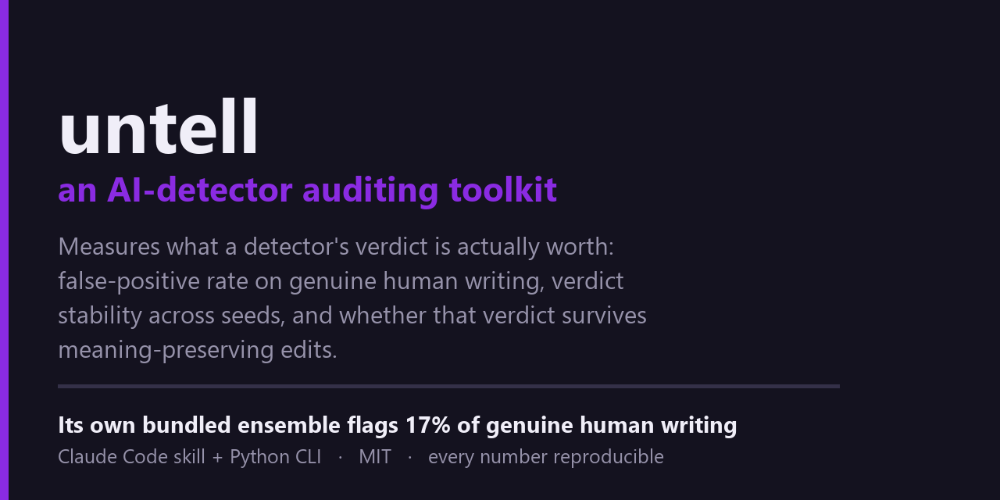

<div align="center">

<a href="https://ssamba1.github.io/untell/"></a>

# untell — the open-source AI humanizer that *closes the loop*

### Iteratively rewrite AI-generated text against live AI-detector scores until it reads human — while keeping your meaning, citations, and facts intact.

A **closed-loop, detector-feedback** AI humanizer, shipped as a **Claude Code skill** *and* a Python CLI.
Free. Open source. Honest about what it can and can't do.

[](https://github.com/ssamba1/untell/actions/workflows/ci.yml)
[](LICENSE)
[](https://www.python.org/)
[](#-quick-start)
[](#tiers)
[](CONTRIBUTING.md)
[](https://ssamba1.github.io/untell/)
[](https://github.com/ssamba1/untell/labels/good%20first%20issue)

**Optimize against real detectors — with the detector *in the loop*, not blind guessing.** Out of the box it
beats the **free web checkers** (ZeroGPT, live-proven 100%→0%). To actually beat **GPTZero · Originality.ai ·
Turnitin-class · Copyleaks**, you wire *their* API into the loop (key-gated, paid) — the bundled **local
proxies alone do *not* predict those, and we [say so plainly](#honest-caveats)** rather than fake a "99% human."
[Why this is the most complete open humanizer →](#-why-this-is-the-best-open-source-ai-humanizer)

</div>

---

## TL;DR

Most "AI humanizers" do **one blind paraphrase pass** and plateau at 60–80% detector bypass. This one runs a
**loop**: it *scores* your text against an ensemble of real AI detectors, *rewrites* using each detector's
score as feedback (targeting the exact sentences that read as AI), and *re-scores* — repeating until the
hardest detector stops flagging it **and** a semantic-similarity gate confirms the meaning is unchanged.

That iterative, detector-feedback approach is the strongest *training-free* technique in the published
literature ([arXiv 2506.07001](https://arxiv.org/abs/2506.07001): −88% TPR@1%FPR, transfers across detectors,
preserves meaning) — and **no shipping tool, open or commercial, actually does it.** This repo does.

> ```
> Measured live:  a formulaic AI paragraph went  100% → 0% AI on ZeroGPT  in one loop.
>                 a stickier one went             100% → 35% → 0%          once the loop
>                 used per-sentence feedback to target only the flagged spans.
> ```

```bash
# Zero dependencies. Works right now, in Claude Code:
/untell  <paste your AI-sounding text or a file path>
```

---

## ⚡ Quick start

**Web UI:** [`docs/demo.html`](docs/demo.html) is a front-end for the REST API — **not** an
in-browser detector. Start the server, then open it pointed at that server:

```bash
pip install -e ".[server]" && untell-server     # then open docs/demo.html?api=http://localhost:8000
```

Your text is POSTed to that API. Run it locally and it never leaves your machine; point `?api=` at
a remote host and it does.

**Install the Claude Code skill — one line:**

```bash
# macOS / Linux
curl -fsSL https://raw.githubusercontent.com/ssamba1/untell/main/install.sh | sh
# Windows PowerShell
irm https://raw.githubusercontent.com/ssamba1/untell/main/install.ps1 | iex
```

Then in Claude Code: **`/untell <your text or a file path>`**. Claude is the rewriter; the bundled scripts
score the text and lock your facts. Zero dependencies (lite tier).

**Or install as a Claude Code plugin** (marketplace):

```text
/plugin marketplace add ssamba1/untell
/plugin install untell@untell
```

**As a Python package** (`pip install untell` lands with the first PyPI release — from source today):

```bash
git clone https://github.com/ssamba1/untell && cd untell
pip install -e ".[full]"                          # real detector ensemble on CPU

# One unified command (`untell --help` lists them all; bare `untell` runs the guided demo):
untell humanize "Your AI-sounding paragraph here."   # the closed loop (alias: loop); default $0 composite
untell humanize "text" --rewriter surgical           # NO key needed — runs the loop for $0
untell humanize "text" --rewriter ensemble           # strongest free path: composite + mt + neural, pick best (.[full])
untell score "text" --tier full --threshold 0.3      # just score it
untell tells "text"                                  # count the AI writing tells (naturalness)
untell verify --file draft.txt                       # honest pass/fail per detector
untell compare                                       # head-to-head vs free-humanizer techniques
untell ceiling --rewriter composite --best-of 3 --repeats 3  # measure free evasion (with error bars)

# (every subcommand is also a standalone `untell-<name>` script, e.g. `untell-loop`, `untell-tells`)
```

> **How far does free actually go?** We measured it, then re-measured it twice when the first two
> answers turned out to be wrong. The training-free, no-key loop drops the local open-detector
> ensemble from **100% flagged to 0%** (mean max P(AI) **0.86 → 0.15 ± 0.04**, 27 loop runs), with
> meaning held by an NLI gate plus a predicate-argument veto. An earlier draft of this line quoted a
> tighter figure from three repeats that did not replicate — see the note under the table. The
> largest correction was the detector itself: the
> one detector present at every tier was itself anti-correlated and saturating, so every previous
> number on this page had been measured through it. An earlier
> version of this README claimed the loop was "powerless against content-locked detectors" — that was
> measured with a single rewrite draw and a miscalibrated detector, and **it did not survive
> re-measurement**. Full numbers, method, superseded claims and honest limits:
> [`docs/free-ceiling-measured.md`](docs/free-ceiling-measured.md)
> (the report: [`docs/free-ceiling-report.md`](docs/free-ceiling-report.md)).

<details>
<summary>Manual / MCP install</summary>

```bash
# Manual skill copy:
git clone https://github.com/ssamba1/untell && cp -r untell/untell ~/.claude/skills/untell

# MCP server (Claude Desktop & any MCP client) — exposes score/sentences/untell/verify/scrub as tools:
pip install -e ".[mcp]" && untell-mcp     # (pip install "untell[mcp]" once on PyPI)
```
</details>

---

## How it works

```
/untell <text|file>
  scrub hidden watermark characters — zero-width, tag, control, blank-rendering and
    homoglyph carriers, plus orphaned ZWJ / variation selectors / bidi marks (kept where
    emoji or right-to-left text makes them load-bearing)   (attacks/unicode_tricks.py)
  preserve-lock citations / numbers / quotes / URLs / entities / code / paths /
    CLI flags / env vars   (scripts/preserve.py)
    — scrub first, on purpose: locking first would capture any hidden characters inside a
      locked span into the mapping, and the final restore would put them straight back
  repeat up to N times:
    score = scripts/score.py <text>          # ensemble of detectors -> {detector: P(AI), max}
    sentences = scripts/sentences.py <text>  # which sentences read as AI (target only these)
    meaning = NLI gate: no contradiction AND bidirectional entailment  (scripts/entailment.py)
              + predicate-argument check: roles not permuted            (scripts/roles.py)
              + quantity check: every number survives                   (scripts/numerals.py)
              + certainty check: no hedge dropped, no claim added       (scripts/hedges.py)
              the last two are stdlib-only and run even with no ML installed
    if max(score) < threshold and sim ok: stop
    Claude rewrites the flagged sentences using the per-detector scores as feedback
      (raise burstiness + perplexity, vary sentence architecture, kill clichés/formulaic
       transitions, diversify vocab — while keeping meaning + every locked span)
  restore locked spans -> humanized text + a before/after detector table
```

Three design choices make it work where blind paraphrasers fail:

1. **It drives the `max` across detectors, not the average** — a rewrite only wins when the *hardest*
   detector is satisfied (genuine multi-detector evasion).
2. **Every rewrite is gated on meaning by an NLI check, not cosine similarity** — it *refuses* the
   meaning-mangling that wrecks other tools' output. Cosine similarity alone was measured to fail in
   **both** directions: it passed rewrites that INVERT the source ("runs faster" → "runs slower"
   scores 0.974 against a 0.76 bar) while rejecting 6 of 8 faithful formal→casual rewrites, because
   it penalises register change — exactly what humanizing does. The gate requires no
   contradiction *and* bidirectional entailment: 7/8 faithful rewrites admitted, **0/11**
   meaning-lost ones, versus 2/8 and 4/11 for the similarity bar it replaced.

   NLI has a blind spot of its own, so a **predicate-argument check** sits behind it. Rewrites that
   keep every content word and only permute the roles — "the company sued the regulator" → "the
   regulator sued the company" — score 0.99 entailment, because as bags of tokens they are identical.
   Word order cannot separate those from a faithful voice change, so `scripts/roles.py` compares
   parsed (subject, verb, object) structure with the passive normalised into active order:
   **9/9 role permutations caught, 0/13 faithful rewrites falsely vetoed** by that check. End to end
   the gate admits **0 of 25** meaning-changing rewrites — role swaps, negation flips, altered
   quantities, dropped hedges, association reported as causation, and dropped attribution.

   The full gate is a conjunction — similarity floor, contradiction, bidirectional entailment,
   predicate-argument structure, retained quantities, retained claim strength. Measured on the
   faithful set it now rejects **0 of 13**, and on **~70 candidates the composite rewriter actually
   produced** (25 texts × 3 runs, since the rewriter is randomised) it passes **96–100%**, mean 99%
   across runs. The only rejection left is the predicate-argument check, at ~1%.

   Both numbers moved because the claim-strength check was over-strict in ways that had nothing to
   do with claim strength: "due to", "will", "set to" and "going to" were classed as *intention*
   hedges, so every rewrite of "the delay was due to X" or "this function will return X" was vetoed;
   "hint" was missing from the *evidential* class, so swapping one weak hedge for another read as
   dropping it; and a negator more than 30 characters from its verb was invisible, so a rewrite that
   explicitly *denied* causation was vetoed for asserting it. Tightening that same pass closed a
   real leak in the other direction — "critics allege the firm misled investors" → "the firm misled
   investors" cleared every check, because dropping an attribution does not contradict the source,
   it just asserts more. The quantities check moved too: it read only DIGITS, so "three sites took
   part" → "five sites took part" passed, and reading spelled-out numbers on both sides closed that
   while removing the last of its false vetoes on real candidates.
3. **Citations, numbers, quotes, URLs and named entities are locked byte-for-byte** via preserve-lock, so
   your APA/IEEE/MLA references and your facts survive the rewrite untouched.

---

## 📉 The measured free ceiling

*How far does $0 actually get you? We measured it.* Most humanizers sell a fantasy ("99% human, undetectable!"). We did the opposite: we **measured** the
real ceiling of a free, training-free loop and published the numbers, the method, and the limits.
The published state of the art (92–97.6% attack success) **needs GPU fine-tuning**; the literature had
**no data point** for the inference-only regime this tool runs in. With a working local detector stack we
produced it — see **[`docs/free-ceiling-measured.md`](docs/free-ceiling-measured.md)** (research:
**[`docs/free-ceiling-report.md`](docs/free-ceiling-report.md)**).

Reproduce it yourself, no API key, on CPU:

```bash
UNTELL_DISABLE_MAGE=1 untell-ceiling --rewriter composite --tier full --best-of 3 --max-iters 2 --repeats 3
```

| Free, no-key rewrite vs the local open ensemble (3 repeats = 9 loop runs) | before | after |
|---|---|---|
| flagged rate (max P(AI) ≥ 0.30) | 1.00 | **0.00** (`--best-of 3`, 27 loop runs) |
| mean max P(AI) | 0.86 | **0.15 ± 0.04** (`--repeats 9`) |
| meaning similarity (cosine; the gate is NLI + roles) | — | **0.93 mean, 0.87 worst** |

Per detector, before → after: `hc3_roberta` 0.73 → 0.06, `roberta_openai` 0.52 → 0.08,
`perplexity_burstiness` 0.41 → 0.12, `fast_detectgpt` 0.21 → 0.03.

> ⚠️ **Read that table with its corpus.** Those are `untell-ceiling`'s **built-in sample: three
> hand-written paragraphs, mean 36 words.** They read as AI, and they are measurably *easier* than
> real AI output — they start at 0.86 where actual ChatGPT answers start at **1.00**. Holding length
> constant on HC3 pairs (tier=full, best-of-3):
>
> | corpus | words | before | after | still flagged |
> |---|---|---|---|---|
> | built-in sample | 37 | 0.86 | **0.23** | **0%** |
> | HC3 ChatGPT answers, cut to 36w | 36 | 1.00 | **0.63** | **50%** |
> | HC3 ChatGPT answers, full length | 186 | 1.00 | **0.76** | **83%** |
>
> The gap is the **corpus, not the length** — at identical length the built-in sample lands three
> times lower. Length then adds on top, because detectors take the `max` over windows and the loop
> has to clear *every* window: a separate sweep at 348–1601 words ended at 1.00, still flagged.
>
> So the table above measures the loop's **mechanics on short, easy text** — it is a demo, not a
> claim about real AI documents.

**The number against real AI text** — 8 HC3 ChatGPT answers, mean 195 words, 24 loop runs:

```bash
UNTELL_DISABLE_MAGE=1 untell-ceiling --dataset hc3 --n 8 --rewriter composite --tier full --best-of 3 --max-iters 5 --repeats 3
```

| | built-in sample | **real HC3 answers** |
|---|---|---|
| mean max P(AI) | 0.86 → 0.15 ± 0.04 | 1.00 → **0.86 ± 0.001** |
| flagged rate | 1.00 → 0.00 | 1.00 → **1.00** |
| meaning similarity | 0.93 / 0.87 worst | 0.98 / 0.95 worst |

Per detector: `roberta_openai` 0.99 → **0.09** (crushed), `fast_detectgpt` 0.64 → 0.26,
`perplexity_burstiness` 0.62 → 0.43, **`hc3_roberta` 1.00 → 0.81 (barely moves)**.

Not one sample cleared, and the spread across three repeats is 0.001 — the loop hits the same wall
every run. It is not a lack of effort: **89–93% of tokens are rewritten**, and `roberta_openai`
going to 0.09 on that same text proves the rewriter is working. `hc3_roberta` measures *subject
matter*, and a meaning-preserving rewrite is not allowed to change that. Similarity stays at 0.98
for the same reason — it is a content metric too.

So the honest summary: **style detectors fall, the content detector does not, and one unclearable
passage flags the whole document** because the ensemble aggregates with `max`. Measured per text,
the spread is between texts rather than along length — a 207-word paragraph reaches 0.40 while a
199-word one never leaves 0.999 — so a longer document is worse mainly because it is another chance
to contain a text the loop cannot clear.

Two obvious-looking fixes were measured and **refuted**: exiting early when the loop stalls (it
would have cost the improvable text more than half its gain), and clearing each paragraph separately
before reassembling (no difference — the paragraphs do not clear either). Full method, the falsified
claims and the corpus caveat: [`docs/free-ceiling-measured.md`](docs/free-ceiling-measured.md)
(Results 10–12). Every result now carries the `corpus` it came from, and a built-in-sample run says
so in its output.

¹ Figures marked `--best-of 8` predate the detector calibration fixes and are indicative only. The
"after" number improved (0.26 → 0.18, flagged 0.15 → 0.07) when two detectors were recalibrated —
not because the rewriter got better, but because the detectors had been over-scoring *everything*,
including the loop's own output. The "before" number barely moved (0.859 → 0.859): AI text is
flagged just as confidently. See the note on false-positive rates below.

**Use `--repeats 9`, not 3.** Two independent 3-repeat runs of the identical command gave
0.247 ± 0.015 (flagged 0.00) and 0.330 ± 0.118 (flagged 0.44) — one contained a single 0.496 draw
that moved its mean by 0.08. A low stdev across three repeats does not mean the estimate is stable.
The instability is the rewriter's randomness, and repeats average it out; the current 9-repeat
figure is **0.15 ± 0.04, flagged 0.00** over 27 loop runs. See
[`docs/free-ceiling-measured.md`](docs/free-ceiling-measured.md).

More draws buy **reliability, not a lower average**: 3 → 8 barely moves the mean but halves the
run-to-run spread and clears every sample. Meaning is measured alongside, so a good evasion number
can't hide a mangled rewrite.

Per-detector, before → after (9 repeats, 27 loop runs, post-recalibration):

| detector | before | after |
|---|---|---|
| `perplexity_burstiness` | 0.41 | **0.14** |
| `roberta_openai` | 0.52 | **0.11** |
| `hc3_roberta` (content/genre) | 0.73 | **0.05** |
| `fast_detectgpt` (curvature) | 0.21 | **0.02** |

**The detectors were flagging human writing, and AUROC could not see it.** Measured on 40 HC3 pairs
at the default 0.30 threshold, before the fixes in this section: `fast_detectgpt` scored human prose
at a mean of 0.510 and flagged **92%** of it; `perplexity_burstiness` flagged 32%. The ensemble
aggregates with `max`, so the full tier flagged **95% of human documents** — it would have told
almost any writer their own work was machine-generated, and the loop would then have rewritten it.

Both were pure calibration: each logistic had its midpoint at the human mean or at the class
midpoint rather than where the threshold needed it. AUROC was 0.999+ throughout and never moved by
more than 0.001, which is why the detector audit reported both as healthy. Refit on 40 pairs and
checked on 60 unseen ones:

| | human mean | human flagged | AI caught |
|---|---|---|---|
| full ensemble, before | 0.520 | 95% | 100% |
| full ensemble, after | 0.164 | **12%** | 100% |
| lite, before | 0.244 | 32% | 100% |
| lite, after | 0.136 | **5%** | 100% |

`untell-detector-audit` now reports false-positive rate alongside AUROC and has a `MISCALIBRATED`
verdict, because a threshold-free metric cannot catch this class of bug on its own.

Three further findings, all measured, and one of them overturned this project's own earlier conclusion:

- **The "content tell" was mostly a *selection* limit — on this corpus.** An earlier version of
  this table (measured with a single rewrite draw) showed HC3-RoBERTa stuck at 0.73 → 0.67 and
  concluded no meaning-preserving rewrite could move it. With **best-of-3 selection against the tier
  you actually score on**, it drops to **0.04**. The lever was never a cleverer rewriter — it was
  choosing among several drafts against the real signal.
  **Scope correction:** that holds on the built-in sample. On real HC3 answers the same selection
  leaves `hc3_roberta` at **1.00 → 0.81**, which is what the original claim described — while
  `roberta_openai` still falls to 0.09, so selection is a real lever and content is still the wall.
  Both results, and the caveat that `hc3_roberta` is *trained on* HC3, are in
  [`docs/free-ceiling-measured.md`](docs/free-ceiling-measured.md) (Results 10–11).
- **The one "immovable" detector turned out to be broken — and once fixed, it moves.**
  `fast_detectgpt` never budged in any configuration (0.31 → 0.28) because its calibration constants
  assumed a curvature range the model never produces, pinning **every** input to ~0.30 regardless of
  content. Recalibrated, it turns out to be the *strongest* baseline signal (0.63, not 0.31) and it
  drops to 0.25 under rewriting. All four local detectors move.
- **The local proxies partly anti-correlate with human-ness.** A rewrite that reads *obviously* more human
  scored **higher** on the proxy (0.578 → 0.918). So a low local score means "passed the weak local
  proxies," not "reads human" and **not** "beats GPTZero." That's exactly why the loop treats the local
  score as a weak hint and gates hard on meaning instead.

**The honest ceiling:** for free you can strip the lexical/perplexity tells *and* most of the
content/genre signal, and clear the *free* web checkers — but the curvature detector still doesn't
move, and clearing the local proxies does not imply clearing GPTZero / Originality / Turnitin (which
need their API in the loop — paid). The tool says so, everywhere.

---

## 🏆 Why this is the best open-source AI humanizer

We surveyed **~110 open-source humanizer repos** (GitHub topics, papers-with-code, the research SOTA) as part
of building this project. That deep-research survey ([`humanizer-research-report.md`](humanizer-research-report.md)) concluded, verbatim:

> *"There is **no** open-source repo that combines (a) a real evasion approach validated against multiple
> live detectors, (b) a quality/meaning-preservation verifier, (c) an iterative detector-feedback loop at
> inference time, and (d) a user-installable package."*

**This is the repo that has all four.** Here it is against the strongest open competitors:

| Capability | **untell (this repo)** | lynote (1.4k★) | patina (196★) | StealthHumanizer (58★) | harshaneel (51★) | Aboudjem (97★) | StealthRL (research) |
|---|:--:|:--:|:--:|:--:|:--:|:--:|:--:|
| Inference-time **detector-feedback loop** | ✅ | ❌ | ◑ own score | ◑ multi-pass | ◑ manual | ❌ | ◑ train-time |
| **Real detectors** in the loop (not an internal score) | ✅ | ❌ | ❌ | ❌ | ◑ Binoculars only | ❌ | ✅ ensemble |
| **Commercial** adapters (Originality/GPTZero/Turnitin-class) | ✅ 6 | ❌ | ❌ | ❌ | ❌ | ❌ | ❌ |
| **Semantic meaning gate** + citation lock | ✅ | claim | ◑ rollback | ◑ keyword | heuristic | ❌ | ✅ BERTScore |
| **Per-sentence** targeting | ✅ | ❌ | ◑ | ❌ | ❌ | ❌ | ❌ |
| **Live bypass proof** (real score shown) | ✅ ZeroGPT 100→0 | ❌ | ❌ | ❌ | ◑ Binoculars | GIF | ✅ paper |
| Packaged **install** (pip *and* Claude skill) | ✅ both | ✅ | ✅ | web app | ✅ skill | ✅ skill | ❌ research |
| **CI** on real models | ✅ | ❌ | ✅ | ✅ | ❌ | ❌ | ❌ |
| Runs **without a GPU** | ✅ | ✅ | ✅ | ✅ | ✅ | ✅ | ❌ |
| License | MIT | MIT | MIT | MIT | MIT | MIT | MIT |

**Stars are not capability.** lynote (1.4k★) is an unvalidated translation chain with no loop or verifier;
the highest-starred repos win on SEO, not architecture. The full, evidenced breakdown — including the *one*
place we're honestly **not** #1 (StealthRL's GPU-trained RL policy is a stronger raw *attack model*, though
it's a training framework, not a usable tool) — is in **[docs/why-best-open-repo.md](docs/why-best-open-repo.md)**
and the ~110-repo capability audit in **[docs/competitive-gap-plan.md](docs/competitive-gap-plan.md)**.

**vs the *free SaaS* humanizers** (Undetectable, QuillBot, HIX Bypass, Humanize AI Pro, …): they all
reduce to 3–4 mechanisms we already implement, so we benchmark them apples-to-apples and measure that
our loop is the **only** technique that drives the AI-tells rate to **zero while preserving meaning**.
Their "99% bypass" claims don't survive independent testing (Originality flags the top "free" tool at
**100% AI**). The reproducible head-to-head, the catalog, and the honest verdict:
**[docs/humanizer-comparison.md](docs/humanizer-comparison.md)**.

---

## Tiers

The scripts auto-detect what's installed and **degrade gracefully** — the score JSON reports which `tier`
actually ran, so you always know how much to trust the number.

| Tier | Install | Detectors | Notes |
|---|---|---|---|
| **lite** | *(default — nothing to install)* | perplexity + burstiness heuristic; token-overlap quality | Stdlib only, **weak** — a demo signal, not an evasion claim. Instant on a clean install; if `torch` happens to be present it silently upgrades to GPT-2 perplexity (better math, ~11s first call). `UNTELL_LITE_NO_TORCH=1` forces the genuinely-instant stdlib path (0.2s). |
| **full** | `pip install -e ".[full]"` | + RoBERTa-OpenAI, HC3-RoBERTa, MAGE, Fast-DetectGPT, GPT-2 perplexity; MiniLM cosine quality | Real proxy signal on CPU. Downloads models on first run. |
| **+ RADAR** | `UNTELL_ENABLE_RADAR=1` (opt-in) | + RADAR — the **paraphrase-robust** detector, the hardest open one to fool | ⚠️ `TrustSafeAI/RADAR-Vicuna-7B` is **non-commercial licensed** — research/eval only. |
| **heavy** | `pip install -e ".[heavy]"` | + Binoculars (2×Falcon-7B) | GPU recommended. Eval only. The local LLM-as-judge is **opt-in** (`UNTELL_ENABLE_LOCAL_JUDGE=1`), not part of any default tier: **3.7s per call** against 0.03–0.06s for every other detector, for **AUROC 0.59** — barely above chance. Worse, it scores human text at a mean of 0.85 and flags **89%** of it, and since the ensemble takes `max` that made the whole heavy tier flag 90% of human documents against full's 15%. A 1.5B model asked "rate how likely this is AI" answers high almost regardless of input; that is instruction-following, not detection. |
| **commercial** | `pip install -e ".[commercial]"` + your keys | + Originality.ai, GPTZero, Winston, Sapling, ZeroGPT, Copyleaks, **LLM-as-judge** | The real checkers. Key-gated; nothing runs or bills unless you set a key. LLM-as-judge = a frontier model rates AI-likelihood against the ai-tells catalog (often the best free-of-proxy signal). |

```bash
untell-score "Your text here" --tier full --threshold 0.3
echo "piped text" | untell-score

# The full tier loads real models (~20s on first run, cached after) — the CLI says so before it
# starts. Add -q/--quiet to silence the notice; stdout stays pure JSON either way.
UNTELL_LITE_NO_TORCH=1 untell-score --tier lite -q "instant, stdlib-only, no network"
```

---

## Passing the real commercial detectors

Local detectors are *proxies*. To optimize for the checkers people actually care about — **GPTZero,
Originality.ai, Turnitin-class, Copyleaks, ZeroGPT, Winston, Sapling** — wire the real APIs. Each is
**key-gated**; nothing runs or bills unless you set its key.

```bash
pip install -e ".[commercial]"
export GPTZERO_API_KEY=...      ORIGINALITY_API_KEY=...   WINSTON_API_KEY=...
export SAPLING_API_KEY=...      ZEROGPT_API_KEY=...       COPYLEAKS_EMAIL=...  COPYLEAKS_API_KEY=...

untell-loop  "text" --tier commercial      # rewrite until EVERY configured checker passes
untell-verify "text" --threshold 0.30      # pass/fail per checker + overall verdict (exit 0 = all pass)
untell-prove "Your AI text" --margin 0.10  # verify → loop → re-verify: one before/after table
```

`untell-verify` exits `0` only when **every** configured checker scores under the threshold. `untell-prove`
runs the whole thing end-to-end so you get an honest before/after AI% per checker. (Each `--tier commercial`
iteration calls every checker, so it **costs API credits** — cap with `--max-iters`.)

### Free ways to test without paying

```bash
# No key at all — deterministic CPU word-substitution rewriter drives the loop ($0, no SDK):
untell-loop "text" --rewriter surgical --tier full
untell-ceiling --rewriter composite --tier full --best-of 3 --repeats 3   # vs the local ensemble

# Check the detectors themselves before trusting a number any of them produced:
untell-detector-audit                # fast smoke test — catches a dead or inverted detector
untell-detector-audit --pairs 100    # the real measurement: AUROC on labelled human/AI pairs
                                     # (needs .[eval]; only this mode supports a discrimination claim)

# Optimize against a REAL detector for free via its web UI (slow, needs a browser):
pip install -e ".[browser]" && playwright install chromium
untell-verify --browser zerogpt "text"     # drives the free ZeroGPT web UI — no API key, $0
untell-loop   "text" --browser zerogpt      # iterate against the LIVE ZeroGPT detector until it clears
```

The **`--rewriter surgical`** path makes the whole loop runnable with **no API key, no GPU, no model
download** — the bundled deterministic rewriter (PWWS/TextFooler-style word-importance substitution)
stands in for the hosted LLM. Weaker than Claude-as-rewriter, but it's what makes the free measurement
above reproducible. (In Claude Code, `/untell` uses Claude itself as the rewriter — also free.)

Free rewriter backends, weakest → strongest (all no-key): **`surgical`** (word swaps, zero-dep) →
**`structural`** (sentence-level transforms) → **`composite`** (structural + surgical, the default) →
**`neural`** (T5 best-of-N paraphrase + composite; needs `.[full]`) → **`ensemble`** / **`max`** (runs
composite + mt_pivot + neural and keeps the per-input detector-lowest — `>=` any single method).
T5-base paraphrase is high-variance on its own (a single draw can *raise* a detector score), so the
neural path samples several and keeps the best, and the ensemble only ever adopts a rewrite that beats
the original — see [`docs/free-ceiling-measured.md`](docs/free-ceiling-measured.md).

The `--browser` path drives a real headless browser through a free web checker and reads the % score.
**ZeroGPT ships built-in** (confirmed working live). Most other free detectors are now bot-gated
(reCAPTCHA / login-redirect / iframe widgets) — see [docs/free-detector-probes.md](docs/free-detector-probes.md).
Add your own site with **zero code** — it's just CSS selectors in a JSON file
([examples/browser_sites.example.json](examples/browser_sites.example.json)).

> ⚠️ Browser checking is **slow, fragile, and ToS-caveated** — for occasional checks on your own text, not
> the hot loop. The reliable multi-detector path is the key-gated commercial tier.

---

## ❓ FAQ

<details>
<summary><b>Is there a free AI humanizer that actually works?</b></summary>

Yes — the lite tier installs with **zero dependencies** and the `--browser zerogpt` path optimizes against a
real detector for **$0**. "Actually works," honestly: the loop reliably clears the *free* web detectors
(ZeroGPT live-measured 100%→0%), and the full/commercial tiers optimize against the harder ones. No tool —
this one included — can promise it passes *every* commercial detector forever; the ones that claim "99%
human" are lying. This repo tells you the real per-detector score instead.
</details>

<details>
<summary><b>Does it bypass GPTZero / ZeroGPT / Turnitin / Originality.ai?</b></summary>

It *optimizes and verifies against* them. ZeroGPT is built into the free browser path and live-proven.
GPTZero, Originality.ai, Turnitin-class, Copyleaks, Winston and Sapling are wired as **key-gated commercial
adapters** — the loop drives the max across every checker you configure below threshold. Originality.ai is
genuinely the hardest (the research literature and public benchmarks consistently rank it the toughest to evade); we don't
claim to beat it without your API key to prove it. Honesty is the point.
</details>

<details>
<summary><b>Will it ruin my meaning, citations, or numbers?</b></summary>

No — that's the core differentiator. A **semantic-similarity gate** rejects any rewrite that drifts too far
from the original meaning, and **preserve-lock** freezes citations, numbers, quotes, URLs and named entities
byte-for-byte. Other humanizers are known to inject grammar errors and even reverse facts when they paraphrase
blindly; this one refuses meaning-breaking rewrites by design. Good for academic / legal / ESL writing.
</details>

<details>
<summary><b>How is this different from Undetectable.ai / QuillBot / WriteHuman?</b></summary>

Those are closed SaaS that do a single blind pass and report a fake binary "human/AI." This is open source,
runs a **closed detector-feedback loop**, optimizes against **multiple real detectors at once**, gates on
**meaning preservation**, and gives you an **honest, reproducible per-detector score** instead of a marketing
claim. It's a research/defensive tool you can read, audit, and run yourself.
</details>

<details>
<summary><b>Is this against the rules / ethical?</b></summary>

AI detectors are noisy proxies — they falsely flag non-native English writers at high rates (~61% in some
Stanford-cited studies). This exists as a **research harness and a defense against false positives**, not an
academic-dishonesty aid. Don't use it to misrepresent authorship where that's prohibited. See the caveats
below — we mean them.
</details>

---

## Eval harness (research)

Validates the thesis — closed loop beats single-pass — without a human in the seat (a scripted rewriter
stands in for Claude so it's measurable):

```bash
pip install -e ".[full,eval]"
python -m eval.benchmark --dataset builtin --n 5                      # zero-download smoke run
python -m eval.benchmark --dataset raid --n 200 --tier full --enable-radar   # adversarial: hardest detector + RAID

untell-ceiling --rewriter composite --best-of 3 --repeats 3   # free inference-only evasion (no key, $0)
untell-eval-policy --policy out/rl-humanizer --vs-base   # A/B a trained LoRA policy vs the untuned base
```

The report shows **per-detector beat-rates** and names the **hardest detector to beat** (the honest
headline). `untell-ceiling` measures how far the free loop moves the local ensemble (see the
[measured ceiling](#-the-measured-free-ceiling)); `untell-eval-policy`
scores the optional GPU-trained single-pass policy (`training/`) against held-out text.
`--enable-radar` adds the paraphrase-robust RADAR detector (non-commercial — research/eval only).
For broader cross-detector benchmarking, [IMGTB](https://github.com/kinit-sk/IMGTB) + the
[RAID](https://github.com/liamdugan/raid) leaderboard are the standard references.

---

## Repo layout

```
untell/            # THE SKILL (this dir is what you install)
  SKILL.md           # trigger + loop procedure + rewrite rubric
  scripts/           # cli (unified `untell`) · score · tells · preserve · quality · sentences · run · verify
  detectors/         # base protocol + tiered adapters (8 local + 7 commercial incl. LLM-as-judge)
  rewriter/          # optional rewriters: hosted (Anthropic/OpenAI) · surgical (no-key) · local LoRA policy
  attacks/           # surgical substitution · homoglyph · scrub · back-translation
  references/         # thresholds.md · prompt-rubric.md · ai-tells.md
eval/                # benchmark · ceiling (free evasion) · compare_humanizers (vs technique classes) · eval_policy
training/            # GPU moat: RL-against-ensemble (GRPO+LoRA) · surrogate distillation
tests/               # unit tests (lite runs with zero ML)
docs/                # humanizer-comparison · free-ceiling report + measured · why-we're-best · competitive audit
```

## Development

```bash
pip install -e ".[dev]"
ruff check .
pytest -q
```

CI runs a **lite** matrix (ruff + pytest, no downloads) across Python 3.9/3.11/3.12 **and** a **full-tier**
job (Ubuntu, CPU torch + `.[full,eval]`) that loads the real RoBERTa / Fast-DetectGPT / GPT-2 detectors and
runs the torch-gated tests. See **[CONTRIBUTING.md](CONTRIBUTING.md)** to get involved and
**[ROADMAP.md](ROADMAP.md)** for what's next (the GPU RL-against-ensemble moat).

---

## Troubleshooting

**Full-tier detectors come back as `null`, you see `failed_detectors`, or a "NumPy 2.x" warning.**
The supervised detectors load `torch`/`transformers`; older builds of those were compiled against
NumPy 1.x and crash on import when NumPy 2.x is present. untell **excludes** any detector that fails to
load — it never fakes a neutral `0.5` that would silently pin your score — lists it under
`failed_detectors`, and honestly downgrades the reported `tier` (so a broken full-tier run reports
`lite`, not a fake `full`). To get the full ensemble back, align the versions, ideally in a fresh venv:

```bash
python -m venv .venv && . .venv/Scripts/activate     # (. .venv/bin/activate on macOS/Linux)
pip install -e ".[full]"            # pulls torch/transformers matched to your NumPy
# …or pin NumPy down in an existing env:
pip install "numpy<2"
```

**`mage` is always `null`.** `yaful/MAGE` ships a config current `huggingface_hub` rejects (`id2label`
validation). It's auto-excluded and the rest of the ensemble runs normally — nothing you need to fix.

**Full tier feels slow.** Each `untell-score` call loads the models fresh, and the first run downloads
~0.5 GB of weights (cached after that). For a multi-iteration run prefer the single-process headless
loop — `untell-loop` loads the models once — over many one-off score calls. The **lite** tier needs
no downloads at all. (The [web UI](docs/demo.html) is a front-end for the REST API, so it inherits
whatever tier the server it talks to is running — it does not score in the browser.)

## Honest caveats

- **Proxy ≠ commercial.** The local detectors approximate; they aren't Originality.ai / Turnitin. The
  ensemble is a *signal*, not a verdict. "Passes all checkers" is unprovable against detectors you don't run.
- **Local proxies do NOT predict GPTZero / Originality.** Measured: a rewrite the bundled local ensemble rates
  *low* can still score **100% AI on GPTZero**, which runs dedicated anti-humanizer ("AI Paraphrasing")
  detection. A low local `max` means "passed the weak local proxies," **not** "undetectable." The only way to
  optimize for a specific commercial detector is to put **it** in the loop (`--tier commercial` + its API key)
  — and even then GPTZero/Originality are the hardest and nobody beats them reliably.
- **lite is a demo.** The zero-install heuristic shows the loop; it's not an evasion claim. The full tier is
  the honest baseline; Binoculars (GPU) is the strongest proxy.
- **Claude is the rewriter.** Output quality and evasion depend on the running model.
- **Ethics.** Detector false-positives disproportionately harm non-native writers. This is a research/eval
  harness and a defense against that — not a plagiarism or academic-dishonesty aid.

## Contributing

PRs, detector adapters, and new free-checker selectors are welcome — see
**[CONTRIBUTING.md](CONTRIBUTING.md)**, the **[good first issues](https://github.com/ssamba1/untell/issues)**,
and our **[Code of Conduct](CODE_OF_CONDUCT.md)**. Found a security issue? See **[SECURITY.md](SECURITY.md)**.

If this saved you from a false AI flag — or you just think it's the most honest humanizer on GitHub —
a ⭐ helps others find it.

## License

[MIT](LICENSE). Free to use, modify, and distribute.
